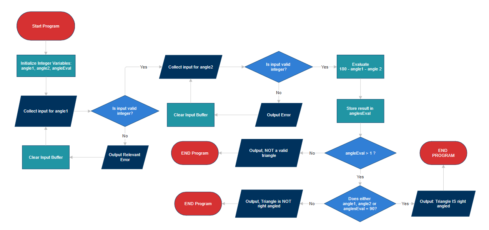

# Group Beau COS 102 Project 100 lvl 2nd Semester
This repository contains 2 folders with 4 files with code written in C, solving [these questions](./questions.md)


## Right Angle Triangle checker
A program that collects two angles of a triangle and determines if it is or isnt a right angle triangle


## Setup

Clone CSC102-Right-angle-triangle-checker into your preferred directory

```bash
    git clone https://github.com/Miva-Beau-Fashion/CSC102-Right-angle-triangle-checker.git
```

## Run triangle checker
Open terminal, run the following right after cloning the repo

``` bash
  cd CSC102-Right-angle-triangle-checker
```


### Run [angleChecker.c](./angleChecker.c)
If you want to try the Angle Checker without a function
```pwsh
  gcc solution.c -o solution
```

```pwsh
  ./solution.exe
```


### Run [angleCheckerWFunction.c](./angleCheckerWFunction.c)  
If you want to try the Angle Checker with a function (less lines of code)

```pwsh
  gcc solutionFunction.c -o solutionFunction
```

```pwsh
  ./solutionFunction.exe
```

## Flowchart and algorithm
### [Flowchart](./solutionFlowchart.png)

### [Algorithm](./algorithm.md)
STEP 1: START  
STEP 2: INITIALIZE INTEGER VARIABLES `angle1`, `angle2`  , and `angleEval`  
STEP 3: COLLECT AND STORE FIRST ANGLE IN `angle1`  
STEP 4: VALIDATE FIRST INPUT, AND THE VALUE OF `angle1`  
 - IF INVALID, PRINT ERROR, CLEAR INPUT BUFFER, AND RETRY FROM STEP 3
 - IF VALID, CONTINUE

STEP 5: COLLECT AND STORE SECOND ANGLE IN `angle2`  
STEP 6: VALIDATE SECOND INPUT, AND THE VALUE OF `angle2`  
 - IF INVALID, PRINT ERROR, CLEAR INPUT BUFFER, AND RETRY FROM STEP 8  
 - IF VALID, CONTINUE
 
STEP 7: EVALUATE AND STORE `180 - angle1 - angle2` IN `angleEval`  
STEP 8: Evaluate
-  IF `angle1 = 90`, `angle2 = 90` or `angleEval = 90`, PRINT "Triangle IS right angled"  
- ELSE PRINT "Triangle is NOT right angled"

STEP 9: END