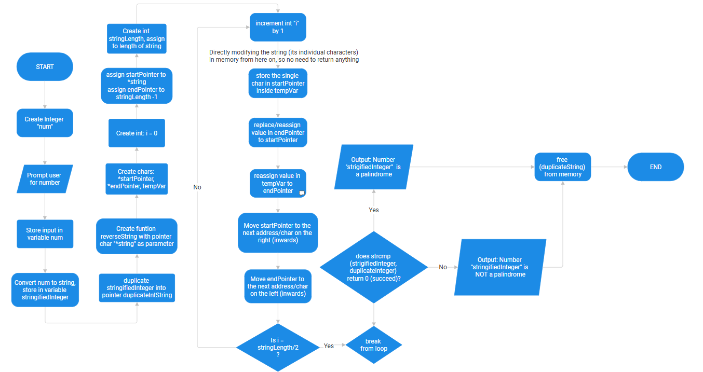

# Group Beau COS 102 Project 100 lvl 2nd Semester
This repository contains 2 folders with 4 files with code written in C, solving [these questions](./questions.md)


## [Right Angle Triangle checker](./triangleChecker.c)
A program that collects two angles of a triangle and determines if it is or isnt a right angle triangle


### Setup

Clone CSC102-Right-angle-triangle-checker into your preferred directory

```bash
    git clone https://github.com/Miva-Beau-Fashion/COS-102.git
```
Open terminal, run the following right after cloning the repo

``` bash
  cd CSC-102
```


#### Run [angleChecker.c](./angleChecker.c)
If you want to try the Angle Checker without a function
```pwsh
  gcc triangleChecker.c -o triangleChecker
```

```pwsh
  ./triangleChecker.exe
```


#### Run [angleCheckerWFunction.c](./angleCheckerWFunction.c)  
If you want to try the Angle Checker with a function (less lines of code)

```pwsh
  gcc triangleCheckerWFunction.c -o triangleCheckerWFunction
```

```pwsh
  ./triangleCheckerWFunction.exe
```

### Flowchart and algorithm
#### [Flowchart](./triangleCheckerFlowchart.png)

#### [Algorithm](./triangleCheckerFlowchart.png)
STEP 1: START  
STEP 2: INITIALIZE INTEGER VARIABLES `angle1`, `angle2`  , and `angleEval`  
STEP 3: COLLECT AND STORE FIRST ANGLE IN `angle1`  
STEP 4: VALIDATE FIRST INPUT, AND THE VALUE OF `angle1`  
 - IF INVALID, PRINT ERROR, CLEAR INPUT BUFFER, AND RETRY FROM STEP 3
 - IF VALID, CONTINUE

STEP 5: COLLECT AND STORE SECOND ANGLE IN `angle2`  
STEP 6: VALIDATE SECOND INPUT, AND THE VALUE OF `angle2`  
 - IF INVALID, PRINT ERROR, CLEAR INPUT BUFFER, AND RETRY FROM STEP 8  
 - IF VALID, CONTINUE
 
STEP 7: EVALUATE AND STORE `180 - angle1 - angle2` IN `angleEval`  
STEP 8: Evaluate
-  IF `angle1 = 90`, `angle2 = 90` or `angleEval = 90`, PRINT "Triangle IS right angled"  
- ELSE PRINT "Triangle is NOT right angled"

STEP 9: END


## [Palindrome Checker](./palindrome.c)
A program that collects a number and checks if it is a palindrome (reverses number and check if it remains the same)

## Setup

Clone CSC102-Right-angle-triangle-checker into your preferred directory

```bash
    git clone https://github.com/Miva-Beau-Fashion/COS-102.git
```
Open terminal, run the following right after cloning the repo

``` bash
  cd CSC-102
```

#### Run [palindrome.c](./palindrome.c)
```pwsh
  gcc palindrome.c -o palindrome
```

```pwsh
  ./palindrome.exe
```

### Flowchart and algorithm
#### [Flowchart](./palindromeFlowchart.png)

#### [Algorithm](./palindromeAlgorithm.md)
STEP 1: START  
STEP 2: INITIALIZE integer variable `num` and character buffer `stringifiedInteger[20]`  
STEP 3: PROMPT user for a number and STORE input in `num`  
STEP 4: CONVERT `num` to string using `snprintf` and STORE in `stringifiedInteger`  
STEP 5: DUPLICATE `stringifiedInteger` into pointer `duplicateIntString` using `strdup` 
 - This creates a unique copy in heap memory for manipulation

STEP 6: CALL `reverseString` function passing `duplicateIntString`:
 - INITIALIZE `startPointer` to the first character address
 - INITIALIZE `endPointer` to the last character address (length - 1)
 - LOOP from `i = 0` while `i < stringLength / 2`:
    - STORE character at `endPointer` in `tempVar`
    - ASSIGN character at `startPointer` to `endPointer`
    - ASSIGN `tempVar` to `startPointer`
    - INCREMENT `startPointer` (move right)
    - DECREMENT `endPointer` (move left)
    - INCREMENT `i` by 1

STEP 7: EVALUATE equality using `strcmp(stringifiedInteger, duplicateIntString)`
 - IF result IS 0:
    - PRINT "The number is a palindrome"
 - ELSE:
    - PRINT "The number is NOT a palindrome"

STEP 8: RELEASE heap memory using `free(duplicateIntString)`
STEP 9: END